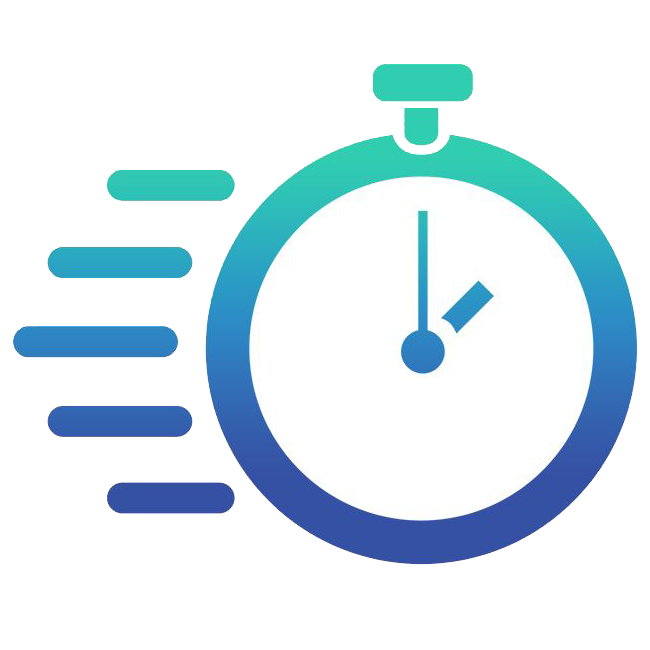

<p align="center">
  
</p>

# TimeTracker

Кроссплатформенное настольное приложение для учета рабочего времени (Windows / macOS / Linux).

## Стек

- **.NET 10** (`net10.0`), **Avalonia UI** — кросс-платформенный интерфейс.
- **CommunityToolkit.Mvvm** — MVVM.
- **EF Core + SQLite** — хранение данных.
- **Serilog** — логирование; **`TimeProvider`** — работа со временем.
- **ScottPlot.Avalonia** — диаграммы в отчетах.
- **Velopack** — упаковка и автообновление.
- **Clean Architecture** — обязательное требование к структуре решения (см. ниже).

## Архитектура

Проект строится по принципам **Clean Architecture** — это **обязательное требование**
(см. `docs/stages/tech-decisions.md`, ADR-002). Слои разделены **отдельными проектами**, правило
направления зависимостей проверяется компилятором.

## Требования

- .NET SDK **10.0**
- Git
- Для отладки UI (только Debug): инструмент **AvaloniaUI.DeveloperTools** — устанавливается отдельно
  (`dotnet tool install --global AvaloniaUI.DeveloperTools`, команда `avdt`). Без него вызов
  `AttachDeveloperTools()` не сможет подключиться к инспектору.

## Команды

| Действие | Команда |
|:--|:--|
| Сборка решения | `dotnet build TimeTracker.slnx` |
| Запуск тестов | `dotnet test` |
| Запуск приложения | `dotnet run --project src/TimeTracker.Desktop` |
| Восстановить инструменты | `dotnet tool restore` |
| Форматирование кода | `dotnet format` |

## Структура репозитория

```
src/
  TimeTracker.Domain/          — сущности, VO, инварианты (ни от чего не зависит)
  TimeTracker.Application/     — сценарии, порты (интерфейсы репозиториев, Unit of Work)
  TimeTracker.Infrastructure/  — EF Core + SQLite, реализации портов, платформенные реализации
  TimeTracker.Presentation/    — ViewModels + Views (Avalonia)
  TimeTracker.Desktop/         — тонкая точка входа: Program, App, DI

tests/   — тестовые проекты
docs/    — план и документация (docs/stages/)
```

**Правило направления зависимостей (обязательное):** `Desktop` → `Presentation` → `Application` → `Domain`;
`Infrastructure` → `Application` → `Domain`. `Domain` не ссылается ни на что; код слоя запрещено размещать
в UI-проекте.

## Лицензия

Уточняется.
