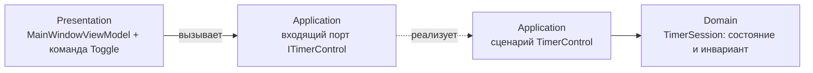

# ADR-010 — Роли портов таймера (управление и чтение)

> **Статус:** принято (этап 04 — `stage-04-start-stop.md`). Решение **заменяет** первую редакцию этого ADR.
> **Связанные решения:** ADR-002 (структура решения, Clean Architecture), ADR-003 (composition root и DI).

---

## Контекст

На этапе 03 таймер умел только показывать время. Слой Application объявлял **исходящий порт** `ITimerService` с единственным методом `Duration GetElapsed()`, а его реализация `InMemoryTimerService` (Infrastructure) открывала запись прямо в конструкторе: сессия всегда «шла», и управлять ею снаружи было нельзя.

Этап 04 делает таймер управляемым: появляется кнопка Start/Stop, команды и MVVM-привязки. Требовалось решить, **куда поместить операции старта и остановки**.

### Почему первая редакция отменена

Первая редакция (вариант A) сохраняла `ITimerService` как исходящий порт и вводила входящий порт `ITimerControl` **рядом**. У этого решения обнаружился дефект: `Duration GetElapsed()` оказывался объявленным **в обоих портах**, а реализация входящего порта сводилась к сквозному делегированию:

```csharp
/// <summary>
/// Возвращает длительность текущей записи к текущему моменту.
/// </summary>
public Duration GetElapsed() => _timerService.GetElapsed();
```

Две подписи на одну операцию плюс передача вызова без добавленной ценности. Решение пересмотрено в пользу варианта C.

Ограничения, действующие в проекте:

- порт всегда называется с приставкой направления — «входящий порт» или «исходящий порт»;
- интерфейс, совмещающий входящий и исходящий порт, по инициативе разработчика не вводится;
- правило зависимостей из ADR-002: `Desktop` → `Presentation` → `Application` → `Domain`, причем `Presentation` не ссылается на `Infrastructure`.

---

## Решение

**Вариант C — один входящий порт, исходящего порта нет.**

1. **`ITimerService` и его реализация `InMemoryTimerService` удаляются.** Исходящий порт для чтения длительности не нужен: сценарий владеет сессией и считает длительность сам.
2. **Наружу остается один входящий порт `ITimerControl`** в проекте `TimeTracker.Application`:

```csharp
/// <summary>
/// Входящий порт: управление активной записью времени.
/// </summary>
public interface ITimerControl
{
    /// <summary>
    /// Признак того, что запись идет.
    /// </summary>
    bool IsRunning { get; }

    /// <summary>
    /// Начинает новую запись.
    /// </summary>
    void Start();

    /// <summary>
    /// Останавливает активную запись.
    /// </summary>
    void Stop();

    /// <summary>
    /// Возвращает длительность текущей записи к текущему моменту.
    /// </summary>
    Duration GetElapsed();
}
```

3. **Состояние сессии хранит доменный тип `TimerSession`** в `TimeTracker.Domain`: он знает, идет запись или остановлена, и сам проверяет инвариант «нельзя остановить незапущенную запись».
4. **Реализация входящего порта — сценарий `TimerControl` в `TimeTracker.Application`.** Входящий порт по канону гексагональной архитектуры реализует ядро, а не адаптер. Сценарий владеет `TimerSession` и `TimeProvider`: `Start` и `Stop` вызывают доменные методы с текущим моментом, а `GetElapsed()` считает длительность напрямую из сессии.
5. **Недопустимое действие недостижимо из интерфейса.** В UI одна кнопка-переключатель, поэтому остановить незапущенную запись пользователь не может. Инвариант домена дополнительно покрыт unit-тестами.
6. **`TimeTracker.Infrastructure` остается в решении без реализации** до этапа 07 (EF Core + SQLite).

Схема ролей:



---

## Последствия

**Положительные:**

- Одна подпись на одну операцию: `GetElapsed` объявлен в порту и реализован ровно один раз, дублирования нет.
- Нет сквозного делегирования: сценарий не перекладывает вызов в другой порт, а считает длительность из доменного состояния.
- У ViewModel одна зависимость — входящий порт.
- Направление зависимостей из ADR-002 сохраняется: `Presentation` знает только о слое `Application`.
- Проверяемость: время приходит из `TimeProvider`, поэтому тесты двигают «сейчас» вручную и не зависят от системных часов.

**Отрицательные и ограничения:**

- Расчет длительности выполняет `Application`, а не отдельный адаптер: вычисление длительности живет в сценарии.
- `TimeTracker.Infrastructure` до этапа 07 не содержит кода — проект остается в решении, но пустым.
- Если позже понадобится читать сохраненные записи из хранилища (например, при восстановлении сессии), исходящий порт придется ввести заново — уже под конкретную задачу.

---

## Альтернативы

### 1. Сохранить исходящий порт и вводить входящий рядом (первая редакция, отклонено)

`ITimerService` остается исходящим портом без изменений, `ITimerControl` вводится для управления, а ViewModel работает с двумя портами.

**Почему отклонено:** `GetElapsed` оказывается объявленным в обоих портах, а реализация входящего порта — сквозным делегированием в исходящий.

### 2. Смешанный `ITimerService` с операциями `Start` и `Stop` (отклонено)

`ITimerService` расширяется до `Start`, `Stop` и `GetElapsed`, и UI работает с одним типом.

**Почему отклонено:** интерфейс совмещает входящий и исходящий порт — он и управляет сессией, и читает время. Это ровно тот случай, который запрещен правилом проекта.

### 3. Оба интерфейса реализует `InMemoryTimerService` (отклонено)

Интерфейсы разделены, но один класс в `Infrastructure` реализует и чтение, и управление.

**Почему отклонено:** входящий порт реализует ядро, а не адаптер; иначе сценарий и инвариант оказались бы вне `Domain` и `Application`.

---

## Ссылки

- ADR-002 — структура решения (Clean Architecture), правило направления зависимостей.
- ADR-003 — composition root и DI: состав зависимостей собирается в `TimeTracker.Desktop`.
- `stage-04-start-stop.md` — план этапа, в рамках которого принято решение.
- `docs/stages/stage-04-start-stop-realize.md` — реализация этапа.
